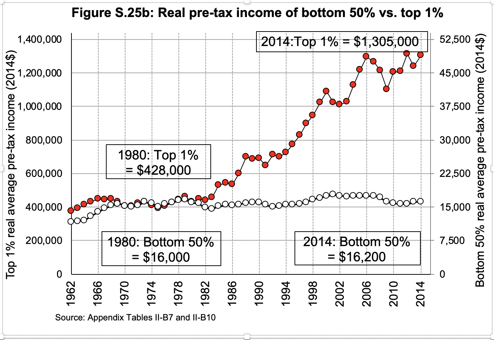
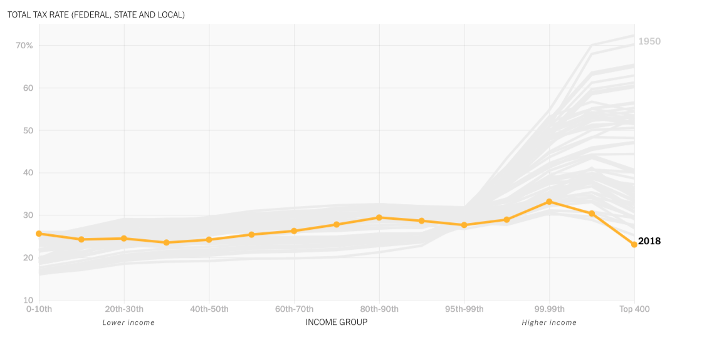

```{r setup, include=FALSE}
knitr::opts_chunk$set(echo = TRUE)
knitr::opts_chunk$set(tidy = TRUE)
knitr::opts_chunk$set(message = FALSE)
knitr::opts_chunk$set(warning = FALSE)
```


## Primary goal of this series of articles  
This goal of this series of articles is to get someone who is proficient in R with an interest in economics up and running with the US data developed by economists [Thomas Piketty](), [Gabrial Zucman](), and [Emmanuel Saez](). I will provide all the code you need to get the source data into an analysis-ready format.  

## Series structure  
The series is broken into two parts.  

Part one will walk the user through all of the transformations step-by-step and then  integrated everything into a single function.  The first section can act as a reference for the analyst as they have questions.  

Part two will explore various questions that can be asked of the data. This section is intended to give the reader some ideas for their own analysis.  

## What are Distributional National Accounts  
Distributional National Accounts are a way to look at the national economy through the lens of the individual to see how income, wealth, and taxes are distributed across a population, in this case the US.  The ultimate goal is to apply this methodology to every developed country so that comparisons across nations are possible.  

For each year, every adult person is represented as a member of a cohort and every dollar of national income is accounted for and reconciled to official US data.  One way to think of the income distribution is to arrange the income of each person in ascending order then select the middle person to see what the median income was for that year.  

## Distributional groups  
I will be using four broad categories of people in this series:  
1. **Working-class** - Those in the 0-50 percentiles  
2. **Middle-class** - Those in the 50-90 percentiles  
3. **Upper-middle-class** - Those in the 90-99 percentiles  
4. **Rich** - Those in the 1%  

I will also create deciles as a separate variable.  

**This table should show Median income across descriptive groups**  

Thank goodness for the `weighted.median()` function in the `spatstat` package.  


In this way you can compare how the working-class are doing compared to the middle-class or the rich.  You can also compare these across years to see how income & wealth distribution has changed over time.  

## Why you should care in six charts  
The data is given in yearly "micro-files" from 1962 to 2018 where each record in the file represents a cohort of US adults.  Their income, wealth and taxes are broken down to a granular level so an analyst can take a deep dive into any segment of the population.  The economists use 2014 as a base year even though 2018 is the latest year and includes the effects of the 2017 Tax Reform.  

Unless you are "Rich" these charts may surprise you.  

### Chart 1 - The bottom 90% vs the top 1%  
You are going to start to see a recurring theme around the year 1980.  This is the year everything started to go off the rails for the average American.  

From 1946 to 1966 income growth for both groups are highly correlated. From 1966 to 1980 the income of the bottom 90% was growing faster than the top 1%.  After 1980 the bottom 90% income still grew at a steady pace from about $30,000 to $38,000 but the income of the rich went from about $600,000 to about $1.3 million per year.  In 1980 it took twenty bottom-90 incomes to equal a single rich person; in 2014 it was 34.21 to 1, indicating that the wealthiest are pulling away from the rest of society.  

*Note:  These plots are mostly ugly.  Maybe this is what Stata charts look like. All of these except that last one were produced by the economists.*  


### Chart 2 - The top 0.1% share of national income  
The adult population in 2014 was 243 million so 0.1% of that is 243,000 people.  Those 243,000 people took 9.3% of all income while the working-class (~120 million people) received 12.5% of national income. 
In 1980 the share of income going to the top 0.1% was less than 4% of the total so their share has more than doubled. 


### Chart 3 - The rise of the Top 10%  
Again, if we look at 1980 the share of income earned by the upper-middle-class and rich went from 35% to 50% in 2012.  It stayed steady at 35% for 40 years before taking off after 1980. 
Notice that the upper-middle-class and rich income share today has surpassed the highest peak before the Great Depression circa ~1928.  


### Chart 4 - The big reversal  
In 1980 the working-class brought in around 20% of all income and the rich brought in about 8%.  By 2014 they have completely switched with rich bringing home 20% of national income and the working-class bringing in around 11%.  The cross-over year was 1995.  

Even to the untrained eye this should look like a transfer of wealth from the bottom 120 million people to the top 243,000 people. 


### Chart 5 - The stagnating incomes of the bottom 50%  
Since 1980 the real average income of someone in the working-class went up $200.  Yes, a raise of $200 over 34 years.  That translates to a total increase of 1.23% or 0.036% per year.  Meanwhile at the country club the income of the rich more than tripled with an average yearly gain of 1.97%.  

350In 2012 Nobel Prize winner Joseph Stiglitz [calculated](https://www.vanityfair.com/news/2012/05/joseph-stiglitz-the-price-on-inequality) that 91% of all GDP gains go to the top 1% and the bottom 99% get to split the remaining 9%. 



### Chart 6 - What happened to all the tax revenue?  
The image below is from an infographic in this excellent [NY Times article](https://www.nytimes.com/interactive/2019/10/06/opinion/income-tax-rate-wealthy.html) that uses the data that we will be working with.  Look at the effective tax rate of the top 400 go from over 70% in 1950 to the lowest tax rate of any group.  This revelation refutes the general assumption that the US has a progressive tax system.  The US **had** a progressive tax system, now it's basically a flat tax that gets regressive at the top.  
It's interesting that the 95th to 99th percentile changed the least over time and serves as a pivot-point.  I highly recommend checking out the NY Times article.  I'll have to figure out how to recreate it in `ggplot()`.  


## What's coming up  
Hopefully this introduction has you eager to start working with the real data.  The next article will walk you through how to get the data and transform it for analysis.  

## End notes  
### The economists  
Distributional national accounts are not a new economic idea but it has gotten renewed interest due to the prolific effort of three French economists, two of which are now working in the US.  

**Thomas Piketty** of the Paris School of Economics released his landmark book [Capital in the 21st Century](https://www.amazon.com/Capital-Twenty-First-Century-Thomas-Piketty-ebook/dp/B074DVRW88/ref=pd_sim_351_1/134-2855640-8324869?_encoding=UTF8&pd_rd_i=B074DVRW88&pd_rd_r=0379234b-5bf2-41dd-84a0-a96590f914cb&pd_rd_w=qjXh7&pd_rd_wg=y4Qj9&pf_rd_p=65e3eab0-d81f-4a76-93ff-f0b7b1d6cd3d&pf_rd_r=M7SJ2E2DQHXTFXFJC0HD&psc=1&refRID=M7SJ2E2DQHXTFXFJC0HD) in 2014 that showed in no uncertain terms that capital income is growing much faster than labor income and that the fruits of any economic gains were disproportionally going to the top 1% of income earners compared to the past. Those with high wealth could grow that wealth at much higher rates than inflation creating dynastic wealth.  Professor Piketty released his follow-up book [Capital and Ideology](https://www.amazon.com/Capital-Ideology-Thomas-Piketty-ebook/dp/B082DKPPP1/ref=pd_sim_351_2/134-2855640-8324869?_encoding=UTF8&pd_rd_i=B082DKPPP1&pd_rd_r=713415f8-9455-4197-b284-44bf33a50c2e&pd_rd_w=mtgxe&pd_rd_wg=0i4kh&pf_rd_p=65e3eab0-d81f-4a76-93ff-f0b7b1d6cd3d&pf_rd_r=K9MKY7TXTGXB5P0M9NBT&psc=1&refRID=K9MKY7TXTGXB5P0M9NBT) in March 2020 and is a NYTimes bestseller even though it is an economics book and over 1000 pages long; that's about 40 hours for those of us that prefer to listen.  Piketty has been at this for awhile.  His first book [The Economics of Inequality](https://www.amazon.com/Economics-Inequality-Thomas-Piketty-ebook/dp/B013HZ8U0G/ref=pd_sim_351_1/134-2855640-8324869?_encoding=UTF8&pd_rd_i=B013HZ8U0G&pd_rd_r=44499a69-94a6-4721-b93f-b58904c992ce&pd_rd_w=z66Cv&pd_rd_wg=d1pzH&pf_rd_p=65e3eab0-d81f-4a76-93ff-f0b7b1d6cd3d&pf_rd_r=TJKFD9CY8KWSYTMDQ4X9&psc=1&refRID=TJKFD9CY8KWSYTMDQ4X9) was originally published in France in 1997 and was finally translated to English in 2015. 

**Emmanuel Saez** and **Gabriel Zucman** are both professors of economics at the University of California - Berkeley and have recently released [The Triumph of Injustice: How the Rich Dodge Taxes and How to Make Them Pay](https://www.amazon.com/Triumph-Injustice-Rich-Dodge-Taxes-dp-1324002727/dp/1324002727/ref=mt_hardcover?_encoding=UTF8&me=&qid=) which details the demise of the progressive tax system in the US and elegant solutions that prevent the highest earners from paying a lower tax rate than their help.  They are the primary developers of the US datasets that will be used in this series and have been helpful when I reached out to them with questions concerning the data.  Professor Zucman has also published [The Hidden Wealth of Nations - The Scourge of Tax Havens](https://www.amazon.com/gp/product/022642264X/ref=dbs_a_def_rwt_bibl_vppi_i1) in 2013.  

I think you get the picture of what they are focused on. 

The main site for [US Distributional National Accounts](http://gabriel-zucman.eu/usdina/) is hosted by Gabriel Zucman and contains links to the data, the data appendix/dictionary, and their published paper on the subject.   


Feel free to connect with me through [github](https://github.com/kieroneil/Distributional-National-Accounts), [twitter](@kieroneil) or [LinkedIn](https://www.linkedin.com/in/kier-oneil-data-scientist).  


